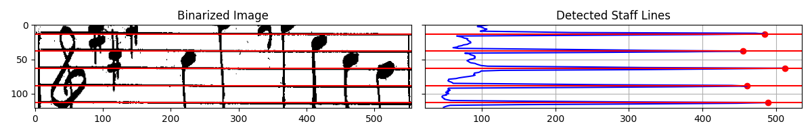

# StaLiX - Staff Line Extractor

StaLiX is a lightweight library designed for staff line detection, primarily used for refining measure bounding boxes in optical music recognition (OMR) pipelines.



## Installation

To get started, create a virtual environment and install the library:

```bash
python3 -m venv .venv
.venv/bin/pip3 install -e .

# install additional dependencies for visualization
.venv/bin/pip3 install -e .[viz]
```

## Usage

For a usage example, refer to [demo](demo/__main__.py). Run demo with:

```bash
python3 -m demo
```

## Algorithm Overview

1. **Binarization**
    - Converts the input grayscale image into a binary image, isolating foreground elements (black pixels).
    - The binarization threshold is configurable via `bin_threshold`.

2. **Black Pixel Summation**
    - Computes the number of black pixels in each row to detect potential staff lines.

3. **Peak Detection**
    - Uses `scipy.signal.find_peaks` to identify local extrema, which serve as initial staff line candidates.

4. **Sanity Checks & Validation**
    - Two validation steps automatically reject invalid proposals:
        - **Spacing Consistency:** The standard deviation of detected staff line spacing is calculated. If it
          exceeds `space_stddev_threshold`, the proposal is rejected.
        - **Bounding Box Shift:** The proposed top and bottom staff line shifts are checked. If proposed shifts exceed
          the image height multiplied by `shift_threshold_factor`, the proposal is rejected.

5. **Output**
    - Returns proposed shifts as `(top_shift, bottom_shift)`, both non-negative integers.
    - If no valid staff lines are detected, `(0, 0)` is returned.

## **Limitations**

- **Not designed for full-page staff detection** – StaLiX is intended to refine **pre-detected** bounding boxes rather
  than process entire sheet music pages. It should be used alongside an object detection model or other methods that
  provide reasonably precise bounding boxes.

- **Untested on complex cases** - Performance may degrade on noisy, low-resolution, or damaged images.

## Acknowledgement

This work is loosely based on the ideas described in these papers:

> B. Su, S. Lu, U. Pal and C. L. Tan, "An Effective Staff Detection and Removal Technique for Musical Documents," 2012 10th IAPR International Workshop on Document Analysis Systems, Gold Coast, QLD, Australia, 2012, pp. 160-164, doi: 10.1109/DAS.2012.16. available online [https://ieeexplore.ieee.org/document/6195355](https://ieeexplore.ieee.org/document/6195355)

> G. Chen, L. Zhang, W. Zhang and Q. Wang, "Detecting the Staff-Lines of Musical Score with Hough Transform and Mathematical Morphology," 2010 International Conference on Multimedia Technology, Ningbo, China, 2010, pp. 1-4, doi: 10.1109/ICMULT.2010.5631269. available online [https://ieeexplore.ieee.org/document/5631269](https://ieeexplore.ieee.org/document/5631269)

## Contact


Developed and maintained
by [Vojtěch Dvořák](https://github.com/v-dvorak) ([dvorak@ufal.mff.cuni.cz](mailto:mayer@ufal.mff.cuni.cz)) as part of
the [Prague Music Computing Group](https://ufal.mff.cuni.cz/pmcg) lead
by [Jan Hajič jr.](https://ufal.mff.cuni.cz/jan-hajic-jr) ([hajicj@ufal.mff.cuni.cz](mailto:hajicj@ufal.mff.cuni.cz)).
